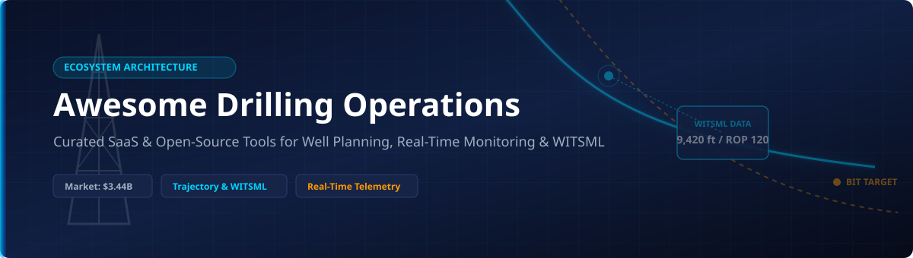

# 🛢️ Awesome Drilling Operations Management Ecosystem

  
  
  
  

## 📌 Overview & Market Intelligence

Welcome to the definitive curated catalog of **Drilling Operations Management Software**, **Well Engineering Platforms**, and **Open-Source Subsurface Analytics Frameworks**.

> 📊 **Market Size & Structure**: The global **Drilling Operations Software Market** is valued at **$3.18 Billion (2025)** and is projected to reach **$3.44 Billion in 2026**, growing at a CAGR of 8.12% toward **$6.95 Billion by 2035**. The sector is **moderately fragmented**: major oilfield service giants (Schlumberger, Halliburton, Baker Hughes) command core integrated enterprise contracts, while specialized software vendors and agile open-source projects capture distinct market niches in autonomous geosteering, WITS/WITSML parsing, and trajectory optimization.

---

## 📑 Table of Contents

- [🏢 SaaS & Commercial Hosted Platforms](#-saas--commercial-hosted-platforms)
- [🔓 Open-Source GitHub Projects & Libraries](#-open-source-github-projects--libraries)
- [🤝 How to Contribute](#-how-to-contribute)
- [☕ Support & Community](#-support--community)
- [📈 Star History](#-star-history)
- [⚠️ Disclaimer](#%EF%B8%8F-disclaimer)

---

## 🏢 SaaS & Commercial Hosted Platforms

*Comprehensive cloud-based drilling management suites, EDR telemetry software, and well engineering platforms sorted by corporate valuation / annual revenue.*

| Platform | Key Focus & Features | Est. Corporate Revenue / Valuation | Starting Pricing Tier | Free Tier / Free Trial Limits |
| :--- | :--- | :--- | :--- | :--- |
| **[DrillOps (SLB / Schlumberger)](https://www.slb.com/)** | Automated drilling control, real-time telemetry, dynamic well planning, and NPT reduction. | **~$33.1 Billion** annual revenue (SLB Parent) | Contact Sales (Enterprise Subscriptions) | Guided 14-Day Enterprise Demo |
| **[WellPlan (Halliburton Landmark)](https://www.landmark.solutions/WellPlan)** | Comprehensive well engineering: trajectory design, hydraulics, casing stability, torque & drag. | **~$23.0 Billion** annual revenue (Halliburton Parent) | DecisionSpace 365 modular subscriptions (Contact Sales) | Guided Enterprise Demo upon request |
| **[OpenWells (Halliburton Landmark)](https://www.landmark.solutions/OpenWells)** | Field activity capture, daily drilling reports (DDR), wellbore schematics, and completions logs. | **~$23.0 Billion** annual revenue (Halliburton Parent) | DecisionSpace 365 modular licensing | Enterprise Demo upon request |
| **[Pason Live (Pason Systems)](https://www.pason.com/)** | Electronic Drilling Recorder (EDR) data aggregation, rig instrumentation, and live remote dashboards. | **~$300 Million** annual revenue / ~$800M Market Cap | Custom Rig/Day Subscription Rate | 30-Day Managed Rig Trial |
| **[Peloton WellView](https://www.peloton.com/)** | Lifecycle well data management, NPT tracking, daily operations reporting, and cost control. | **~$100 Million+** annual revenue (Privately Held) | Custom Annual License Quote | 14-Day Corporate Pilot Trial |
| **[RigER](https://www.riger.us/)** | Digital field ticketing, oilfield asset tracking, rig scheduling, and drilling crew billing. | **~$15 Million** estimated annual revenue | **$149/user/month** (Bronze Tier) | Guided Risk-Free Trial Program (No Credit Card required) |
| **[FieldCap](https://www.fieldcap.com/)** | Field operations management, digital ticket capture, and daily rig activity tracking. | **~$10 Million** estimated annual revenue | **$99/user/month** (Base Tier) | 14-Day Free Trial |
| **[WellEz](https://www.wellez.com/)** | Cloud-based daily drilling reporting, operational KPIs, and NPT analysis dashboards. | **~$8 Million** estimated annual revenue | Custom Operator Plan (Contact Sales) | 14-Day Operator Demo Trial |
| **[Wellsite Report](https://www.wellsitereport.com/)** | Daily wellsite reporting tool for small-to-medium operators and drilling contractors. | **~$3 Million** estimated annual revenue | **$75/well/month** | 30-Day Free Unlimited Trial |
| **[Drillnet](https://www.drillnet.net/)** | Operational intelligence platform aggregating real-time rig telemetry and daily DDR summaries. | **~$2 Million** estimated annual revenue | Contact Sales | 14-Day Guided Trial |

---

## 🔓 Open-Source GitHub Projects & Libraries

*Active open-source repositories for well trajectory planning, WITS/WITSML parsing, and subsurface data modeling sorted by GitHub Star count.*

| Repository | GitHub Stars Badge | Description & Core Stack |
| :--- | :--- | :--- |
| **[segyio](https://github.com/equinor/segyio)** |  | Fast Python & C library for SEGY seismic and subsurface well trace data processing created by Equinor. |
| **[welleng](https://github.com/jonnymaserati/welleng)** |  | Python collection of well engineering tools focusing on well trajectory planning, anti-collision analysis, and ISCWSA survey math. |
| **[ert](https://github.com/equinor/ert)** |  | Ensemble-based Reservoir Tool by Equinor for dynamic modeling, sensitivity analysis, and data assimilation (ES-MDA). |
| **[well_profile](https://github.com/pro-well-plan/well_profile)** |  | Python tool for 3D well trajectory calculations, profile generation, and survey desurveying by pro-well-plan. |
| **[witsml-explorer](https://github.com/equinor/witsml-explorer)** |  | Web and desktop WITSML server browser and QA/QC data editor built with React and C# by Equinor. |
| **[pds-technology/witsml](https://github.com/pds-technology/witsml)** |  | Core C# libraries for Energistics WITSML standard parsing and WITSMLstudio server implementations. |
| **[webviz-subsurface](https://github.com/equinor/webviz-subsurface)** |  | Dash/Plotly web visualization plugins for subsurface, reservoir, and well log data. |
| **[pwptemp](https://github.com/pro-well-plan/pwptemp)** |  | Python package for downhole temperature profile prediction during drilling and circulation. |
| **[OpenGeoPlotter](https://github.com/bsomps/OpenGeoPlotter)** |  | PyQt5 application for visualizing geologic drill hole data, cross-sections, 3D views, and downhole strip logs. |
| **[fesapi](https://github.com/F2I-Consulting/fesapi)** |  | C++/Python API supporting ENERGISTICS data standards (RESQML, WITSML, ETP). |
| **[komle](https://github.com/kle043/komle)** |  | Lightweight Python library for parsing and generating Energistics WITSML XML files. |
| **[torque_drag](https://github.com/pro-well-plan/torque_drag)** |  | Python module for calculating soft-string and stiff-string drillstring torque and drag forces. |
| **[Interactive-Well-Trajectory-Plot](https://github.com/maribickpostanes/Interactive-Well-Trajectory-Plot)** |  | Interactive 3D visualization of Equinor's Volve field well trajectories using Plotly. |
| **[target_line_plot](https://github.com/scottkerstetter/target_line_plot)** |  | Python utility for plotting target lines in geosteering and directional drilling workflows. |
| **[sag_correction_quality_control](https://github.com/scottkerstetter/sag_correction_quality_control)** |  | Python quality-control script for extracting and analyzing MagVar Saphira survey sag correction data. |
| **[WellTrajectoryCalculator](https://github.com/aliakseis/WellTrajectoryCalculator)** |  | C++ algorithms for calculating directional well paths based on minimum curvature methods. |
| **[witskit](https://github.com/Critlist/witskit)** |  | Production-ready Python SDK & CLI for decoding raw WITS pre-WITSML streams into SQL databases. |

---

## 🤝 How to Contribute

Contributions are welcome! Please follow these simple steps to add a new SaaS tool or open-source repo:

1. **Fork the repository** 🍴
2. **Create a topic branch**: `git checkout -b add-my-drilling-tool`
3. **Edit `README.md`**: Follow the existing Markdown table format.
4. **Submit a Pull Request** 🚀 with a brief explanation of why the tool is valuable for petroleum engineers.

---

## ☕ Support & Community

If you find this repository helpful in your drilling engineering, software research, or energy domain work, please consider supporting the project!

- 🌟 **Star this repository** to show appreciation.
- 🔀 **Fork & share** with colleagues, petroleum engineering departments, and drilling tech communities.
- 💖 **Sponsor the Maintainer**: Support ongoing open-source maintenance via [GitHub Sponsors](https://github.com/sponsors/ishandutta2007).

---

## 📈 Star History

---

## ⚠️ Disclaimer

- This catalog is a **community-curated index** for informational and educational purposes only.
- Drilling operations software, telemetry streams, and wellbore anti-collision algorithms must strictly comply with industry standards (API, IADC, ISCWSA) and site safety protocols.
- Open-source mathematical models must be independently verified against certified commercial applications before field execution on live drilling rigs.

---

  <b>Built for Drilling Engineers, Well Planners, Energy Software Developers & Petroleum Technologists.</b>

